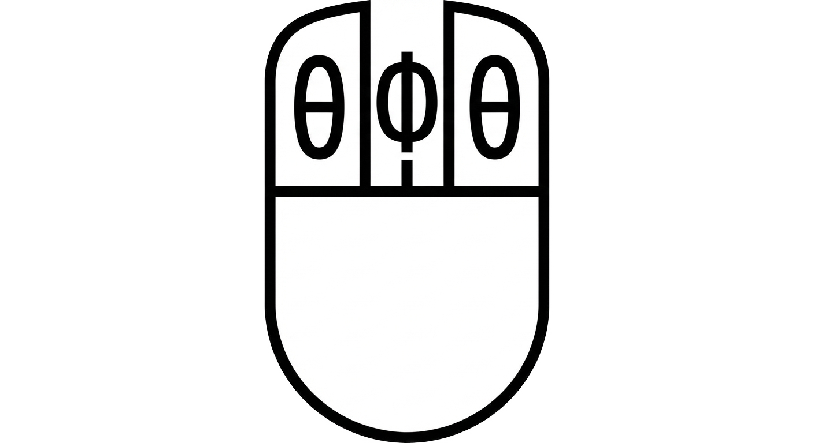

# 🖱️ Project UFA: ZMK Firmware Porting for Commercial Wireless Gaming Mice

**Project to port the open-source ZMK firmware to factory wireless gaming mice.**



## 🚀 Introduction

The main goal of this project is to enable ZMK firmware on many commercially available wireless gaming mice without designing custom PCBs or 3D printing enclosures. The result is a factory-quality mouse with an open, fully configurable firmware, Bluetooth support, and high polling rates.

Many modern wireless mice use a suitable MCU/sensor pair: **nRF52840** (microcontroller) and **PAW3395/PMW3610** (sensor). This pair works well with ZMK.

Currently ZMK does not provide switching bt/ESB dongle modes without reflashing. However, switching between BT/USB modes is possible.

## ✨ Key features

- **Factory quality:** Uses original shell and electronics for high build quality.

- **Full customization:** ZMK features such as unlimited button layers, macros, and behavior settings.

- **Modes:**

  - **USB:** 1000 Hz (when connected by cable)

  - **BT / BT Dongle:** 125 Hz (standard ZMK mode)

  - **ESB (Enhanced ShockBurst):** 1000 Hz (requires [ZMK ESB module](https://github.com/badjeff/zmk-feature-split-esb))

- **Power management:** Battery level indicator (via ADC) and charge status (CHRG).

- **Sensor:** Full support for high-precision optical sensors **PAW3395/PMW3610**.

## 💻 Compatible hardware

Theoretically any mouse based on **nRF52833/nRF52840 + PAW3395/PMW3610** can work.

| Model                                  | MCU      | Sensor  | Status             | Notes                                                 |
| -------------------------------------- | -------- | ------- | ------------------ | ----------------------------------------------------- |
| [**VGN F1 MOBA**](docs/VGN_F1_MOBA.md) | nRF52840 | PAW3395 | ✅ Confirmed        | Pinout matches VXE R1 Pro.                            |
| VGN F1 Pro                             | nRF52840 | PAW3395 | 🧪 Requires testing | High likelihood of compatibility.                     |
| VGN F1 Pro Max                         | nRF52840 | PAW3395 | 🧪 Requires testing | High likelihood of compatibility.                     |
| [**VXE R1 Pro**](docs/VXE_R1_Pro.md)   | nRF52840 | PAW3395 | ✅ Confirmed        | Pinout matches VXE R1 Pro.                            |
| VXE R1 Pro Max                         | nRF52840 | PAW3395 | 🧪 Requires testing | High likelihood of compatibility.                     |
| LAMZU Atlantis Mini 4K                 | nRF52840 | PAW3395 | 🧪 Requires testing | High likelihood of compatibility.                     |
| LAMZU Maya                             | nRF52840 | PAW3395 | 🧪 Requires testing | High likelihood of compatibility.                     |
| Pulsar X2V2                            | nRF52840 | PAW3395 | 🧪 Requires testing | High likelihood of compatibility.                     |
| Hitscan Hyperlight                     | nRF52840 | PMW3610 | 🧪 Requires testing | High likelihood of compatibility.                     |
| [**Zaopin z2**](docs/Zaopin_Z2.md)     | nRF52840 | PAW3395 | ✅ Confirmed        | Pinout matches VXE R1 Pro except for bt/dongle switch |
| Finalmouse UltralightX Competition     | nRF52840 | PAW3395 | 🧪 Requires testing | High likelihood of compatibility.                     |
| Endgame Gear OP1W 4K V2                | nRF52840 | PAW3950 | 🧪 Requires testing | High likelihood of compatibility.                     |
| Waizowl OGM PRO v1                     | nRF52840 | PAW3395 | 🧪 Requires testing | High likelihood of compatibility.                     |
| Obsidian Pathfinder                    | nRF52840 | PAW3950 | 🧪 Requires testing | High likelihood of compatibility.                     |
| Darmoshark M2                          | nRF52840 | PAW3395 | 🧪 Requires testing | High likelihood of compatibility.                     |
| Darmoshark M2 Pro                      | nRF52840 | PAW3395 | 🧪 Requires testing | High likelihood of compatibility.                     |
| Darmoshark M3                          | nRF52840 | PAW3395 | 🧪 Requires testing | High likelihood of compatibility.                     |
| Darmoshark M3 Pro                      | nRF52840 | PAW3395 | 🧪 Requires testing | High likelihood of compatibility.                     |
| Darmoshark M3S Pro                     | nRF52840 | PAW3395 | 🧪 Requires testing | High likelihood of compatibility.                     |
| Darmoshark M3V2                        | nRF52840 | PAW3395 | 🧪 Requires testing | High likelihood of compatibility.                     |
| Darmoshark M3S Max                     | nRF52840 | PAW3950 | 🧪 Requires testing | High likelihood of compatibility.                     |
| Darmoshark M3 Pro Max                  | nRF52840 | PAW3950 | 🧪 Requires testing | High likelihood of compatibility.                     |
| Darmoshark M3 Micro                    | nRF52840 | PAW3395 | 🧪 Requires testing | High likelihood of compatibility.                     |
| Darmoshark M3 Micro Pro                | nRF52840 | PAW3395 | 🧪 Requires testing | High likelihood of compatibility.                     |
| Darmoshark M3XS                        | nRF52840 | PAW3950 | 🧪 Requires testing | High likelihood of compatibility.                     |
| Darmoshark M5                          | nRF52840 | PAW3395 | 🧪 Requires testing | High likelihood of compatibility.                     |
| Darmoshark M5 Pro                      | nRF52840 | PAW3395 | 🧪 Requires testing | High likelihood of compatibility.                     |
| Darmoshark M5 Air                      | nRF52840 | PAW3950 | 🧪 Requires testing | High likelihood of compatibility.                     |
| Darmoshark N3                          | nRF52840 | PAW3395 | 🧪 Requires testing | High likelihood of compatibility.                     |
| Darmoshark N5                          | nRF52840 | PAW3395 | 🧪 Requires testing | High likelihood of compatibility.                     |
| Darmoshark N7 Max                      | nRF52840 | PAW3950 | 🧪 Requires testing | High likelihood of compatibility.                     |
| HSK+ lite                              | nRF52840 | PAW3399 | 🧪 Requires testing | High likelihood of compatibility.                     |

> **NOTE:** Mice with exotic hardware (displays, optical encoders, etc.) may need extra work for full porting.

## 🛠️ Flashing firmware

> **WARNING:** Everything below you do at your own risk. We bear no responsibility for the consequences of your actions.

Flashing requires a hardware programmer (for example, J-Link or ST-Link with SWD support).

## Process to install ZMK on a mouse with a known pinout

### 1. Prepare the board

Prefer boards that have dedicated programming pads. Look for pads labeled **VDD / GND / DIO / CLK**. If no pads exist, you may need to remove the nRF52840, flash it separately, and re-solder it.

> **NOTE:** On VGN and VXE the nRF52 is often covered with compound, but programming pads usually exist.

### 2. Flash the bootloader

> **WARNING:** Powering VDD also powers the sensor. PAW3395 recommends up to 2.1V, while many programmers supply 3.3V. This could damage the sensor. In our experience we have not encountered damage, but you can desolder the sensor or use a lower-voltage programmer.

1. Connect the programmer to the pads (VDD/DIO/CLK/GND).
2. If needed, try to save the original firmware using nRF Connect.
3. Erase the chip and flash the configured **bootloader** (with DFU button support).

Example command (adjust file names and port as needed):

```shell
arm-none-eabi-gdb --batch -ex "target extended-remote /dev/tty.usbmodem7FC1A2831" -ex "mon swdp_scan" -ex "file mouse_bootloader.hex" -ex "att 1" -ex "mon erase" -ex load
```

See [this documentation](https://github.com/joric/nrfmicro/wiki/Bootloader#unlocking-nrf52-and-flashing-bootloader) for details.

The bootloader source is in a [separate repository](https://github.com/aroum/nRF52_Bootloader_custom_LED/blob/5936ab87a88837a1c39a1478db058357e6ef2a13/src/boards/mouse/board.h). Prebuilt binaries are available in the [releases](https://github.com/aroum/nRF52_Bootloader_custom_LED/releases/tag/0.9.2)

**DFU mode:** Since reset is not exposed on known mice, enter DFU by holding the DPI button and plugging in USB. You can also enter DFU via the `&bootloader` keycode from ZMK firmware.

### 3. Build and flash ZMK

1. Build ZMK firmware using provided device configuration files (boards, shields).
2. Enter the bootloader (hold DPI button and plug in USB, toggle must be off).
3. Copy the *.uf2 file to the USB mass storage device that appears.

ZMK config repository for [VGN F1 MOBA / VXE R1 Pro / Zaopin z2](https://github.com/greengrocer98/lariska/tree/main)

## 🔬 Reverse-engineering the mouse (find the pinout)

If the pinout for your mouse is unknown, you can help the project by discovering it and sharing the results.

### Methods to find pinout

1. **Remove the chip and probe all contacts:** Fastest method. Desolder nRF52840, trace pins with a multimeter, then resolder the chip.
2. **Measure voltage drops:** Measure voltage drops on pins of a reference nRF52840 and compare to target board pin voltages (see `docs/nrf52840_v_drops/README.md`).
3. **Test firmware with Direct Pin:** Create minimal firmware that logs a pin ID when grounded. Then ground pins one by one to find functions.

## 🙏 Thanks

Special thanks to [**@greengrocer98**](https://github.com/greengrocer98/) for significant contributions to reverse engineering and development.

## Links

- [stm32_paw3395_mouse](https://github.com/Li-Dongze/stm32_paw3395_mouse) - A repository with code examples for working with the STM32 microcontroller and the PWM3395 sensor.

- [Cenere Mouse (Open Source Tri-Mode Connectivity)](https://github.com/willwaush/Cenere-Mouse/tree/main) -  A repository with a PCB for a tri-mode mouse
  
- [PAW3395 driver for ZMK](https://github.com/badjeff/zmk-paw3395-driver) - PAW3395 driver for ZMK
  
- [PMW3610 driver for ZMK](https://github.com/badjeff/zmk-pmw3610-driver) - PMW3610 driver for ZMK
  
- [leylabella HW](https://github.com/badjeff/leylabella?tab=readme-ov-file) - mouse with PAW3395 and PMW3610
  
- [leylabella zmk](https://github.com/badjeff/leylabella-zmk-config) - ZMK config for the leylabella mouse
