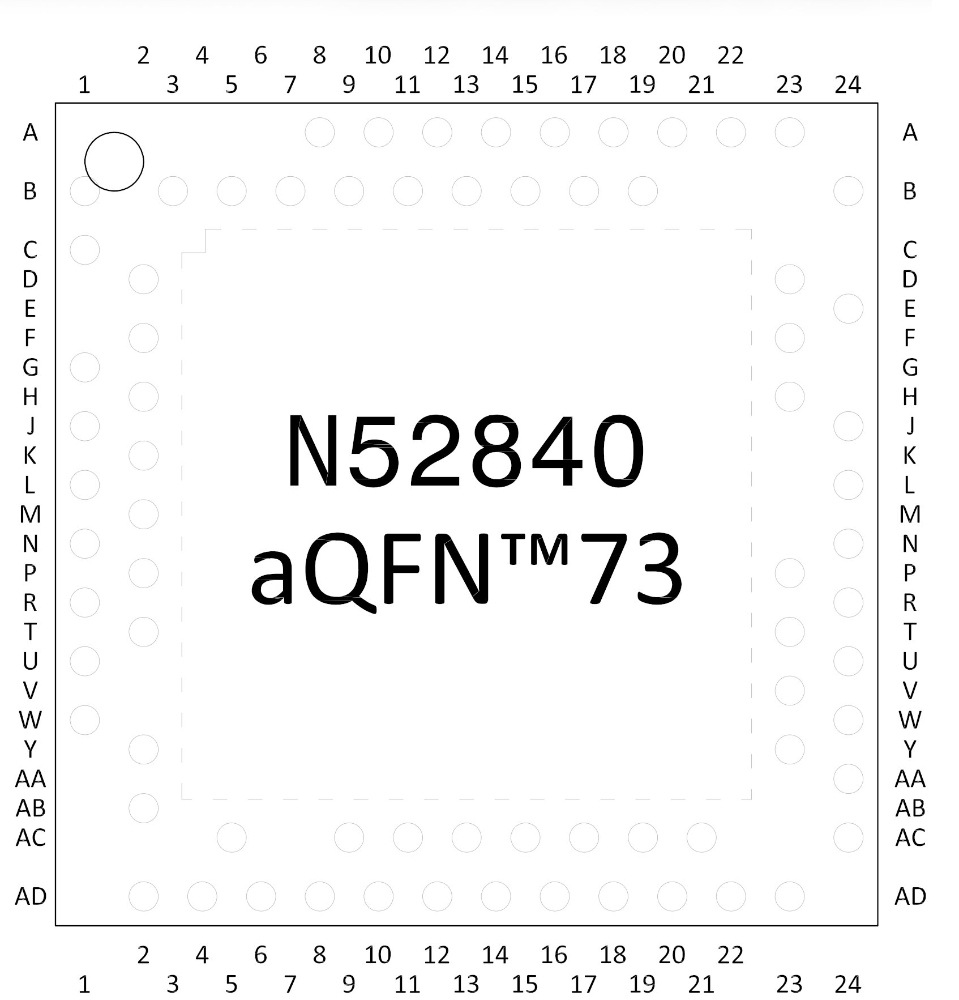

# Voltage drops on nRF52840

The file [nrf52840_v_drop.csv](nrf52840_v_drop.csv) contains my voltage drop measurements for each pin of a functional nRF52840 in the aQFN73 package.

The measurement was performed using the DMM's diode check (voltage drop) mode: the red probe was placed on the large central pad (GND), and the black probe was placed on the GPIO pin.

Due to various factors, your measurements may differ from mine; they are provided solely for informational purposes.

As the data shows, the pins can be divided into several groups based on the voltage drop. Although the difference between the values is not very large, it nonetheless allows for pin classification and significantly increases the speed of identifying the pins used on the mouse.
